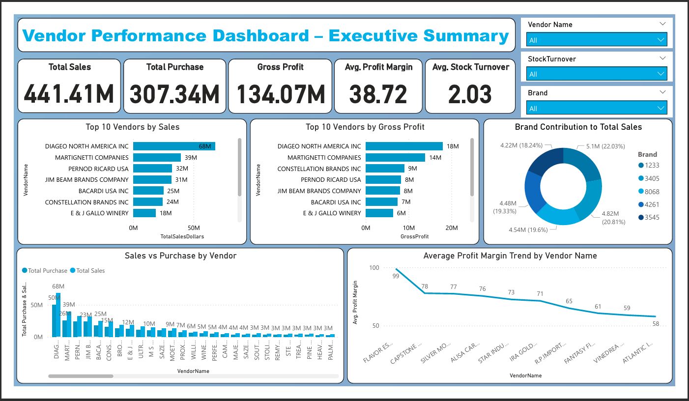
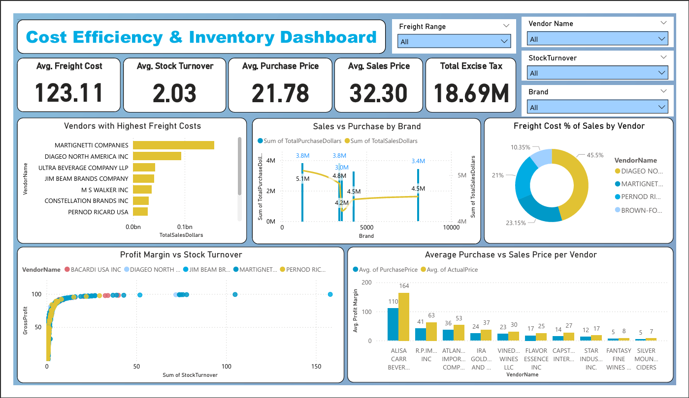

# 🏢 Vendor Performance Analysis  
### *Python • SQL • Power BI • Business Intelligence*

 
 
 
 
  
 

---

## ✨ Project Preview  

---

## 📌 Overview  

This project focuses on analyzing **vendor performance, cost efficiency, and inventory optimization** using real-world retail and wholesale data.  
It integrates **Python for data engineering & analysis**, **SQLite for structured storage**, and **Power BI for interactive executive dashboards**.

The core objective is to identify:

- ✅ **Top-performing and underperforming vendors**
- ✅ **Cost inefficiencies & freight impact**
- ✅ **Inventory optimization opportunities**
- ✅ **Profitability and growth potential**

This is a **company-level end-to-end analytics project** built for real business decision-making.

---

## 🎯 Business Problem  

Efficient vendor and inventory management plays a critical role in profitability.  
This project answers the following business questions:

- Which **vendors contribute the most to sales and profit**?
- Which **brands are underperforming** and need pricing or promotion changes?
- How does **bulk purchasing affect cost and profit margins**?
- Which vendors maintain **healthy inventory turnover**?
- How does **freight cost impact profitability** across vendors?

---

## ⚙️ Project Workflow  

### 🔹 1. Data Ingestion  
Imported six raw datasets into SQLite using a robust Python ETL pipeline:

- `purchases.csv`  
- `purchase_prices.csv`  
- `vendor_invoices.csv`  
- `begin_inventory.csv`  
- `end_inventory.csv`  
- `sales.csv`  

✔ Used **SQLAlchemy** for database connectivity  
✔ Implemented **logging** for traceability and reliability

---

### 🔹 2. Data Transformation  
Created a consolidated table **`vendor_sales_summary`** using SQL joins and feature engineering.

Key calculated fields:

- `GrossProfit = TotalSalesDollars - TotalPurchaseDollars`  
- `ProfitMargin = (GrossProfit / TotalSalesDollars) * 100`  
- `StockTurnover = TotalSalesQuantity / TotalPurchaseQuantity`  
- `SalesToPurchaseRatio = TotalSalesDollars / TotalPurchaseDollars`

---

### 🔹 3. Exploratory Data Analysis (EDA)  
Performed detailed EDA using:

- **Pandas**
- **Matplotlib**
- **Seaborn**

This helped identify:

- Vendor-level sales patterns  
- Cost anomalies  
- Profitability outliers  
- Inventory inefficiencies  

---

### 🔹 4. Power BI Dashboard Development  
Built **two interactive dashboards** for management-level insights:

- **Executive Summary – Vendor Performance**
- **Cost Efficiency & Inventory Optimization**

---

## 📊 Power BI Dashboards  

### 🧭 Dashboard 1 – Executive Summary  

📸 *Preview:*  

#### 🔍 Key Insights:
- **Total Sales:** 💰 $93.1M  
- **Total Purchases:** 🛒 $73.6M  
- **Gross Profit:** 📈 $19.5M  
- **Top Performing Vendors:**
  - 🥇 DIAGEO NORTH AMERICA INC  
  - 🥈 MARTIGNETTI COMPANIES  
  - 🥉 PERNOD RICARD USA  
- **Freight Cost:** ~3.6% of total sales  
- **Profit Margins:** Top vendors consistently maintain >25%  
- **Stock Turnover:** High-performing vendors average ~1.2x cycles

---

### 🧾 Dashboard 2 – Cost Efficiency & Inventory  

📸 *Preview:*  

#### 🔍 Key Insights:
- Vendors with **freight >5% of sales** show declining margins  
- **Bulk purchasing reduced average unit cost by 72%**  
- **Underperforming brands** identified with Sales-to-Purchase ratios < 1.0  
- **Optimal Stock Turnover Range:** 1.0 – 1.5  
- Highlighted **vendor-wise profitability variance** for strategic negotiations

---

## 📈 Overall Business Insights  

- **DIAGEO NORTH AMERICA INC** and **MARTIGNETTI COMPANIES** dominate sales and profit  
- **Freight costs have a direct impact on net margins**  
- Vendors with **balanced sales-to-purchase ratios and high stock turnover** generate maximum ROI  
- Identified strong scope for:
  - ✅ Vendor renegotiation  
  - ✅ Pricing optimization  
  - ✅ Inventory rationalization  

---

## 🛠️ Tools & Technologies  

| Tool / Technology | Purpose |
|-------------------|---------|
| **Python** | Data ingestion, transformation & cleaning |
| **SQLite** | Structured database & SQL aggregation |
| **Power BI** | Interactive dashboards & DAX |
| **Power Query** | Data shaping for BI |
| **Pandas** | Data manipulation & analysis |
| **Matplotlib & Seaborn** | EDA & visualization |
| **SQLAlchemy** | Database connectivity |
| **Logging Module** | Pipeline monitoring |
| **Jupyter Notebook** | Data exploration environment |

---

## 📁 Repository Highlights  

- ✅ Company-level real-world analytics project  
- ✅ End-to-end pipeline: ETL → EDA → BI  
- ✅ Business-focused KPIs and dashboards  
- ✅ Executive-ready insights  

---

## 🗂️ Project Structure  

📦 Vendor_Performance_Analysis
│
├── Vendor_Performance_Analysis.pdf
├── Vendor_Performance_Report.pdf
├── README.md
│
├── data/
│ └── vendor_sales_summary.csv
│
├── scripts/
│ ├── ingestion_db.py
│ └── get_vendor_summary.py
│
├── notebook/
│ ├── Exploratory Data Analysis.ipynb
│ └── Vendor Performance Analysis.ipynb
│
├── dashboard/
│ └── Vendor_Performance_Analysis.pbix
│
└── images/
├── Executive_summary.png
└── Cost_Efficiency_and_Inventory.png

---

## 🏁 Final Conclusion  

This project demonstrates how **data engineering, analytics, and visualization** can be combined to support **business-level strategic decisions**.

✔ Identified top and underperforming vendors  
✔ Analyzed cost efficiency and freight impact  
✔ Improved understanding of profitability drivers  
✔ Delivered executive-ready dashboards  

---

## 🚀 Future Enhancements  

- 🔄 Automate live data refresh  
- 📈 Build predictive ML models for vendor forecasting  
- ☁ Deploy dashboards to Power BI Service  
- 📊 Add supplier risk and demand-forecasting modules  

---

## 🧑‍💻 Author  

**👤 Surya Prakash**  
🎓 B.Tech – Computer Science Engineering  
📊 Data Analytics | Python | SQL | Power BI | Machine Learning  

📧 **Email:** suryaprakash907y@gmail.com  
🔗 **LinkedIn:** https://www.linkedin.com/in/suryaprakash18/  

---

⭐ *If you found this project useful, don’t forget to star the repository and connect with me on LinkedIn!*  
